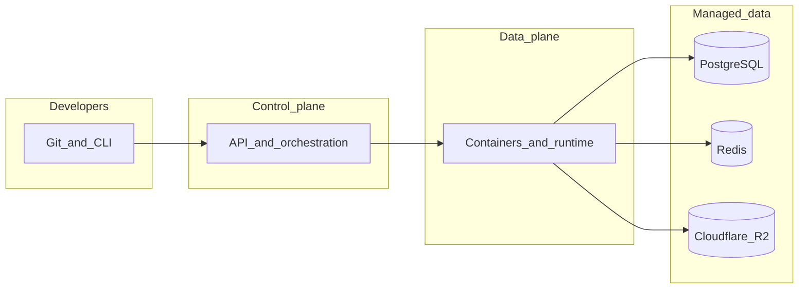

# Serinew

**은하처럼 이어지는 배포 경험을 만듭니다.**

*We build a developer-first deployment cloud — calm, fast, and built for the night sky of shipping.*

## 무엇을 만들고 있나요 · What we build

**Serinew**의 목표는 **애플리케이션 배포·호스팅 클라우드(PaaS)** 입니다.  
저장소의 변경이 곧 빌드·배포·실행 중인 서비스·네트워킹·데이터까지 이어지도록, 개발자가 한 플랫폼에서 끝까지 운영할 수 있게 만듭니다.

We're building a **PaaS** where changes in your repo flow into builds, deploys, live services, networking, and data — **one platform, end to end**, without giving up clarity or control.

## 기술 스택 · Tech stack

| 영역 | 선택 |
|------|------|
| 언어 | Go |
| 데이터 | PostgreSQL, Redis |
| 객체 스토리지 | Cloudflare R2 |
| 컨테이너 | Docker |

## 아키텍처 개요 · At a glance

다음은 대표적인 흐름만 나타낸 **고수준** 다이어그램입니다. (실제 토폴로지·서비스명은 공개 범위에 따라 달라질 수 있습니다.)

## 리포지토리와 문서 · Repos and docs

- **조직 리포지토리**: [github.com/serinew](https://github.com/serinew)
- **문서 / 랜딩**: 공개 시점에 맞춰 안내 예정입니다.

## 기여 · Contributing

공개 리포지토리가 열리면 이슈와 디스커션으로 피드백을 환영합니다.  
조직 차원의 가이드라인은 준비되는 대로 이 README와 각 저장소에 맞춰 정리합니다.
